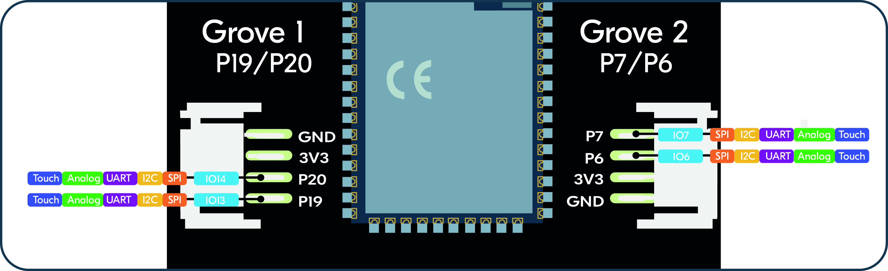
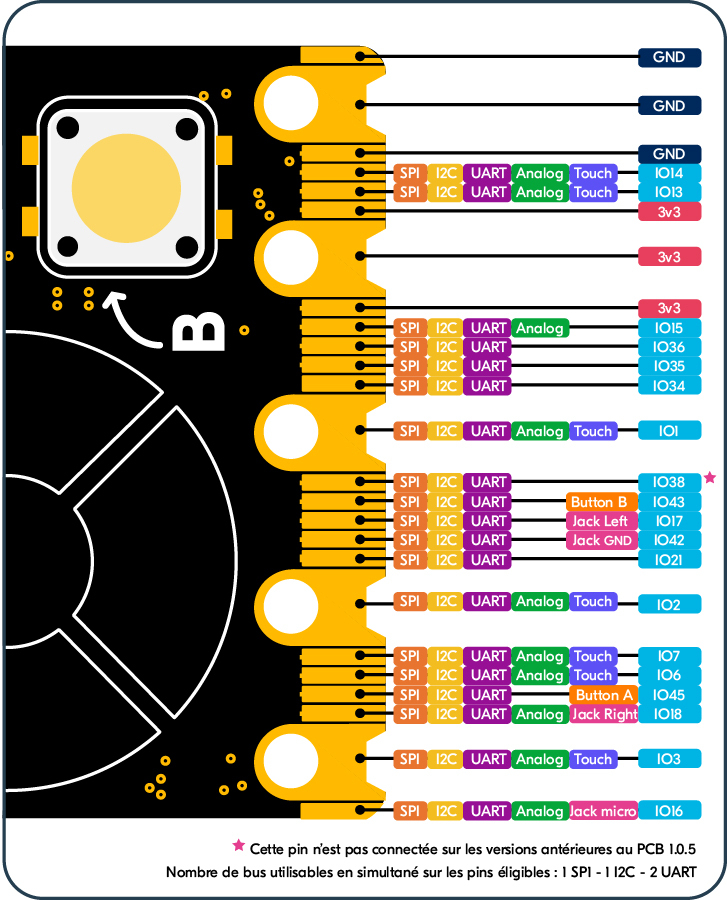

.. _galaxia_general:

Galaxia
========================================

Galaxia board is part of the esp32 port. Every feature of this port is included, additional modules are available to interact with Galaxia specific components.

Additional modules
-------------------

* Thingz module :mod:`thingz`: This module is used to access Galaxia's hardware components
* Ethernet module :mod:`ethernet`: This module add ethernet connectivity using Thingz ethernet module